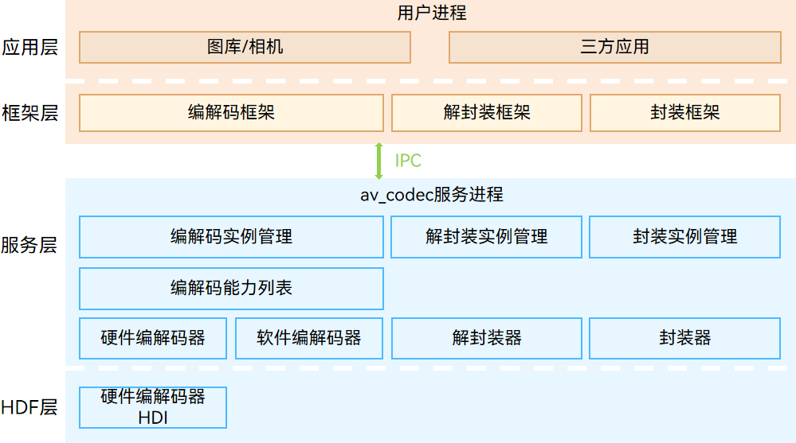

# av_codec部件


## 简介

av_codec部件为OpenHarmony系统提供了统一的音视频编解码、封装、解封装能力，使得应用能够直接调用系统提供的编解码、封装、解封装能力实现音视频的播放、录制、编码等功能。

av_codec部件提供了以下常用功能：
- 音视频编解码
- 音视频解封装
- 音视频封装

**图 1** av_codec部件架构图



### 模块介绍
| 模块名称 | 功能 |
| -------- | -------- |
| 编解码 | 提供音视频编解码功能接口以及编解码能力查询功能接口。 |
| 解封装 | 提供音视频资源的加载、音视频轨分离和音视频数据的读取的功能接口，读取的数据可使用解码器进行解码。 |
| 封装 | 提供将编码后的音视频数据写入媒体文件的功能接口。 |
| 编解码生命周期管理 | 用于服务端编解码功能的创建、销毁、实例管理等。 |
| 解封装生命周期管理 | 用于服务端解封装功能的创建、销毁、实例管理等。 |
| 封装生命周期管理 | 用于服务端封装功能的创建、销毁、实例管理等。 |
| 编解码能力列表 | 用于描述所有编解码器的详细信息，比如名字、mimetype、支持的分辨率等。 |
| 软件编解码器 | 使用CPU进行编解码处理的编解码器，提供编解码处理功能。 |
| 解封装器 | 提供音视频资源的加载、音视频轨分离和音视频数据的读取处理的功能。 |
| 封装器 | 提供将编码后的音视频数据写入媒体文件的功能。 |
| 硬件编解码器HDI | 提供硬件编解码器的抽象接口，通过该接口对服务层屏蔽不同的硬件编解码器，向服务层提供硬件编解码能力。 |


## 目录

仓目录结构如下：

```
/foundation/multimedia/av_codec     # av_codec部件业务代码
├── BUILD.gn                        # 编译入口
├── bundle.json                     # 部件描述文件
├── frameworks                      # 部件无独立进程框架代码的实现
│   └── native                      # native c++实现
├── interfaces                      # 外部接口层
│   ├── inner_api                   # 系统内部件接口
│   └── kits                        # 应用接口
├── sa_profile                      # 部件配置
├── services                        # 服务实现代码
│   ├── dfx                         # dfx代码
│   ├── engine                      # 功能实现
│   │   ├── base                    # 功能基类
│   │   ├── codec                   # 编解码功能实现
│   │   ├── codeclist               # 编解码能力查询功能实现
│   │   ├── common                  # 功能实现公共库
│   │   ├── demuxer                 # 解封装功能实现
│   │   ├── factory                 # 功能实现工厂库
│   │   ├── muxer                   # 封装功能实现
│   │   ├── plugin                  # 插件实现
│   │   └── source                  # 媒体资源读取工具功能实现
│   ├── etc                         # 部件进程配置
│   ├── include                     # 服务对外头文件
│   ├── services                    # 服务IPC实现
│   │   ├── codec                   # 编解码IPC实现
│   │   ├── codeclist               # 编解码能力查询IPC实现
│   │   ├── common                  # 服务IPC实现公共库
│   │   ├── demuxer                 # 解封装IPC实现
│   │   ├── factory                 # 服务IPC实现工厂库
│   │   ├── muxer                   # 封装IPC实现
│   │   ├── sa_avcodec              # 部件主进程IPC实现
│   │   └── source                  # 媒体资源读取工具IPC实现
│   └── utils                       # 服务实现通用资源
└── test                            # 测试代码
```


## 编译构建

编译32位ARM系统av_codec部件
```
./build.sh --product-name {product_name} --ccache --build-target av_codec
```

编译64位ARM系统av_codec部件
```
./build.sh --product-name {product_name} --ccache --target-cpu arm64 --build-target av_codec
```

{product_name}为当前支持的平台，比如rk3568。


## 说明

### 使用说明
使用说明参考[开发指导](./doc/avmuxer-overview.md)


## Changelog
API变更参考[API差异报告](./doc/native-apidiff-4.0.8.1.md)


## 相关仓

- [媒体子系统](https://gitee.com/openharmony/docs/blob/master/zh-cn/readme/%E5%AA%92%E4%BD%93%E5%AD%90%E7%B3%BB%E7%BB%9F.md)